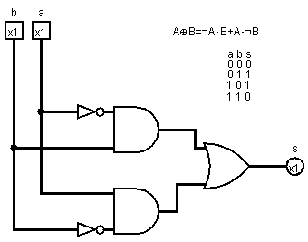
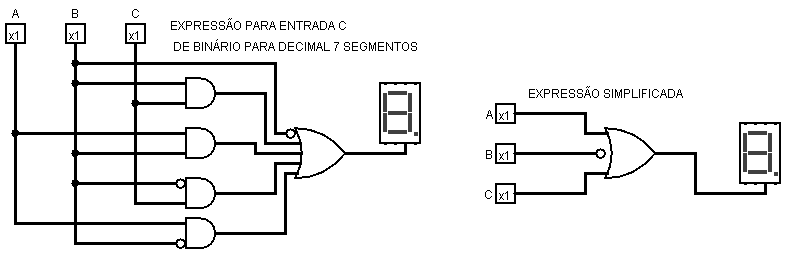

# Circuitos

Aqui estão imagens e descrições dos 17 circuitos, dentro da pasta "docs" se encontra as soluções em formato de relatório técnico.
É recomendado que todos os circuitos estejam no mesmo diretório, pois certos componentes foram utilizados em outros, por exemplo o somador de 8bits na ULA de 8 bits.

## Flip Flop tipo D

## Flip Flop tipo JK

## XOR com AND, NOT e OR

## Somador de 8 bits + 4

## Memória ROM de 8 bits.

## Memória RAM de 8 bits.

## Banco de Registradores de 8 bits.

## Somador de 8 bits.

## detector de sequência binária(101)

## ULA de 8 bits

## Extensor de sinal 4-8

## Máquina de estados

## Contador Síncrono

## Detector de paridade ímpar

## Otimização Lógica 

## Decodificador 7-segmentos para hexadecimal(componentes de A-G estão presentes hexadecimal_display.circ)

