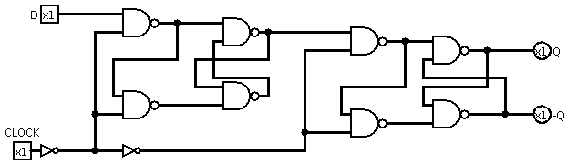

# Circuitos

Aqui estão imagens e descrições dos 17 circuitos, dentro da pasta "docs" se encontra as soluções em formato de relatório técnico.

## Flip Flop tipo D

## Flip Flop tipo JK

## XOR com AND, NOT e OR

## Somador de 8 bits + 4

